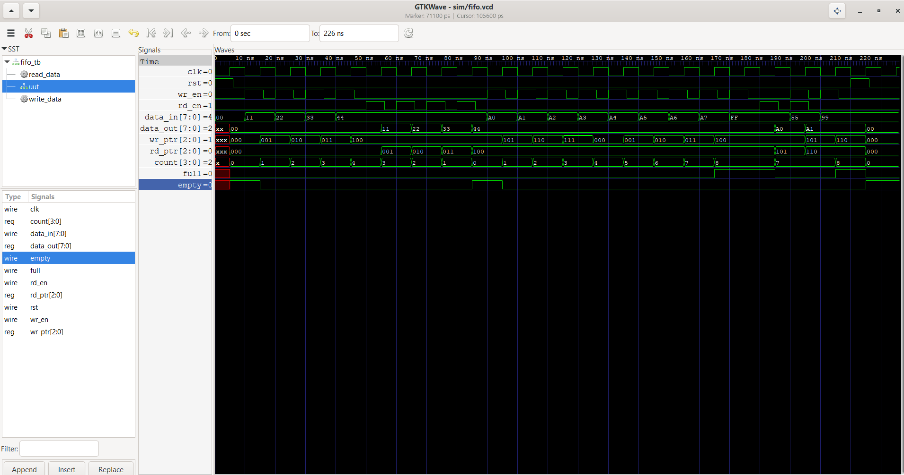

# Synchronous FIFO – Verilog RTL Design & Verification

## Project Overview

This project implements and verifies a synchronous FIFO (First-In First-Out) memory using Verilog.

The FIFO is designed with:

- 8-bit data width
- 8-word storage depth
- Separate read and write pointers
- Occupancy counter
- Full and empty status flags
- Synchronous reset
- Self-checking verification testbench

The project focuses on RTL design, memory organization, pointer management, status flags, and corner-case verification.

---

## Architecture

### FIFO Specifications

| Parameter | Value |
|---|---|
| Data Width | 8 bits |
| FIFO Depth | 8 words |
| Address Width | 3 bits |
| Counter Width | 4 bits |
| Clock | Synchronous |
| Reset | Synchronous |

### Main Components

1. **Memory Array**
   - Stores eight 8-bit data values.

2. **Write Pointer**
   - Points to the location where the next data item will be written.

3. **Read Pointer**
   - Points to the location from which the next data item will be read.

4. **Occupancy Counter**
   - Tracks the number of data elements currently stored in the FIFO.

5. **Full Flag**
   - Asserted when the FIFO contains eight data elements.

6. **Empty Flag**
   - Asserted when the FIFO contains zero data elements.

---

## FIFO Operation

### Write Operation

Data is written into the memory when:

```text
wr_en = 1
and
full = 0
```

The write pointer advances after every valid write operation.

### Read Operation

Data is read from the memory when:

```text
rd_en = 1
and
empty = 0
```

The read pointer advances after every valid read operation.

### Simultaneous Read and Write

The FIFO supports simultaneous read and write operations in the same clock cycle.

When both operations are valid:

- Write pointer advances
- Read pointer advances
- FIFO occupancy count remains unchanged
- Data can be written and read in the same clock cycle

---

## Verification

The testbench verifies the following scenarios:

- Reset operation
- FIFO empty condition
- Data write operation
- Data read operation
- FIFO full condition
- Write attempt when FIFO is full
- Read operation after FIFO becomes full
- Simultaneous read and write
- Reset during FIFO operation
- Full and empty flag transitions

The testbench is self-checking and reports PASS/FAIL results.

---

## Simulation Results

The FIFO was simulated using Icarus Verilog.

Example verification results:

```text
PASS: Reset successful
PASS: EMPTY flag asserted
PASS: FULL flag asserted
PASS: Write blocked when FULL
PASS: FULL cleared after read
PASS: Simultaneous read returned correct data 0xA1
PASS: FIFO count remains 7
PASS: Reset during operation successful

========================================
       FIFO VERIFICATION SUMMARY
========================================
RESULT : PASS
ERRORS : 0
========================================

FIFO VERIFICATION COMPLETED
```

---

## Waveform

The FIFO simulation waveform was analyzed using GTKWave.

The waveform demonstrates:

- Clock and reset behavior
- Write and read enable signals
- Input and output data
- Read and write pointer movement
- FIFO occupancy count
- Full and empty flag transitions

### GTKWave Simulation



---

## Concepts Demonstrated

This project demonstrates practical understanding of:

- RTL Design
- Synchronous FIFO Architecture
- Memory Arrays
- Read/Write Pointers
- Counters
- Status Flags
- Circular Buffer Operation
- Synchronous Reset
- Data Ordering
- Corner-Case Verification
- Self-Checking Testbenches
- Simulation Waveform Analysis

---

## Project Structure

```text
SYNCHRONOUS FIFO/
├── docs/
│   └── fifo_waveform.png
├── rtl/
│   └── fifo.v
├── tb/
│   └── fifo_tb.v
├── .gitignore
└── README.md
```

---

## How to Run

### 1. Compile

```bash
iverilog -g2012 -s fifo_tb -o sim/fifo_tb.vvp rtl/fifo.v tb/fifo_tb.v
```

### 2. Run Simulation

```bash
vvp sim/fifo_tb.vvp
```

### 3. Open Waveform

```bash
gtkwave sim/fifo.vcd
```

---

## Tools Used

- Verilog
- Icarus Verilog
- GTKWave
- VS Code
- Git
- GitHub

---

## Author

**Devi Sri K**

Electronics and Communication Engineering

**Focus Areas:** RTL Design, Verilog, Digital Electronics, VLSI Verification